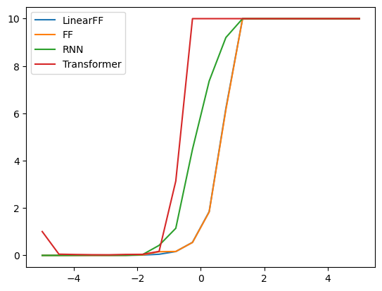
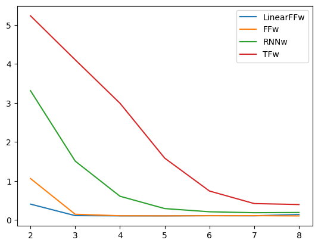
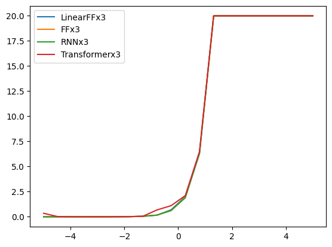
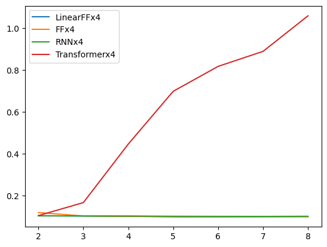

In this project, I explored the performance of time series forecasting models under the setting of autoregressively generated data. In the following sections, I will explain the data generation process, model and discuss some of the experimental results. The code is available at https://github.com/RRemixx/eecs598003.git. \\
## Data generation
The time series data used in this project are generated autoregressively, following the equation below:

$ X(t) = a_1X(t-1) + a_2X(t-2) + a_3X(t-3) + noise $

Later, to explore the models' performance when the underlying relation is nonlinear, a second equation is used to generate the date:

$ X(t) = a_1tan(X(t-1)) + a_2tan(X(t-2)) + a_3tan(X(t-3)) + noise $

## Models
Four models are used in this project: a linear feed forward model without any activation layer, a non-linear feed forward model activated by ReLu, a recurrent neural network model, and a transformer model.

## Metric
The performance of the models is measured by the root mean squared error (RMSE).

## Experiments
### Performance v.s. noise

The models are trained and tested on data generated with different amount of noise. The x axis is $log_{10}(noise\_factor)$, which shows the amount of noise added to the data. The y axis is RMSE. Among the four models, linearFF and FF have almost the same performance, while the transformer is the worst. When noise increases, the transformer model fails first. This is surprising to me because I would think with a more complicated architecture, the transformer model would outperform the other models.

Then it leads to two questions: 1. why does the transformer model fail? 2. where does the transformer model work better? 

For the first one, my hypothesis is that the transformer model might overfit the data, which leads to its bad performance on the test set. To test this hypothesis, I tested the models with different number of neurons. If it's correct, the transformer model should work better with fewer neurons and when the number of neurons is more than some value, RMSE should increase.

For the second one, I think it's because the data is over simplified. Following the suggestion from Professor, I added tangent to the data generation process. The performance of FF should decrease while the performance of transformer should be relatively better. 

### Performance when using different number of neurons

The architecture of four models are fixed. I changed the number of neurons, i.e. the hidden size. The figure below shows the change of RMSE when the number of neurons changes. The x axis is $log_2(hidden\_size)$, y axis is RMSE. The performance of these models is still the same as the prevous experiment. All the models behave better when the hidden size is increased. Surprisingly, the transformer model requires the most number of neurons to achieve a good performance.

### Performance v.s. noise (nonlinear data)

<!-- TODO -->

### Performance when using different number of neurons (nonlinear data)

On nonlinear data, all other models' performance increases when the number of neurons is increased while the transformer model's performance decreases. This can suggest that the transformer model overfits the data. There is also a region on the leftside of the figure where the transformer model outperforms other models. I think the reason is that even with hidden size being $2^2$ the transformer model is still much more complex than other models.

## Summary

It's suprising to me that in the experiments I conducted, the most complicated and advanced model, the transformer, is outperformed by other simpler models. I tried to find out why this model fails. The followup experiments still show surprising results. But it seems to indicate that when the data is even more complex, the transformer model might finally perform the best.  